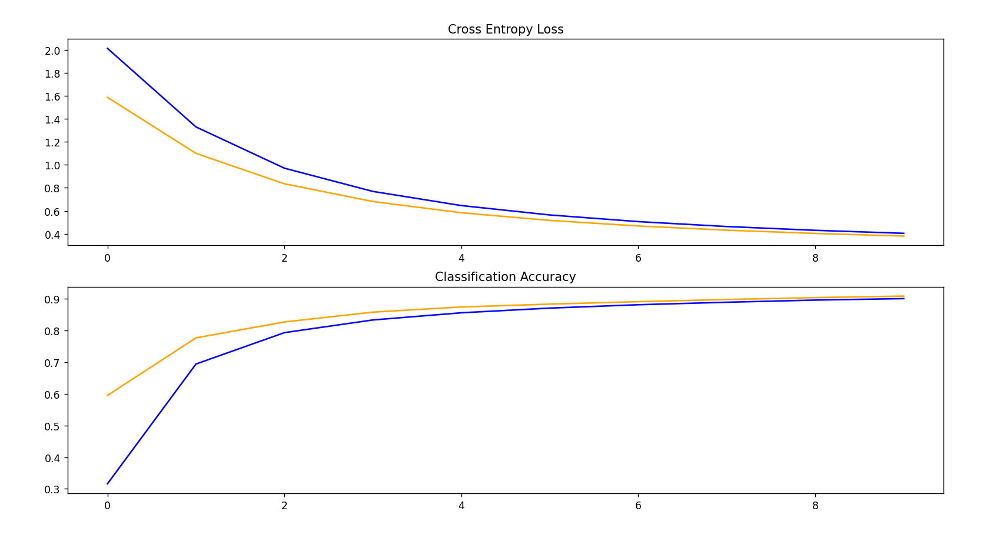
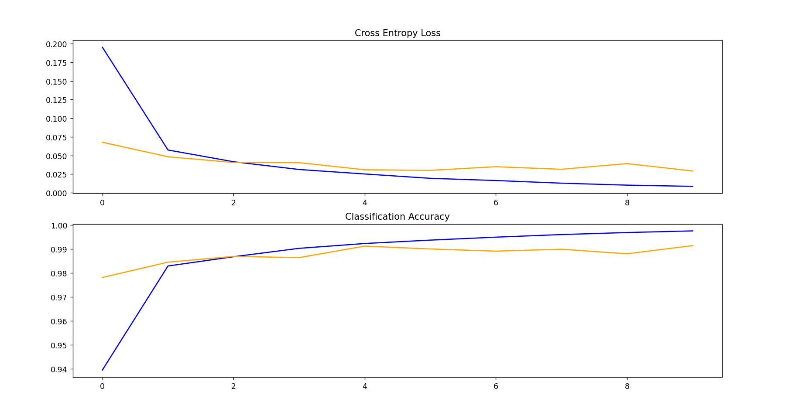
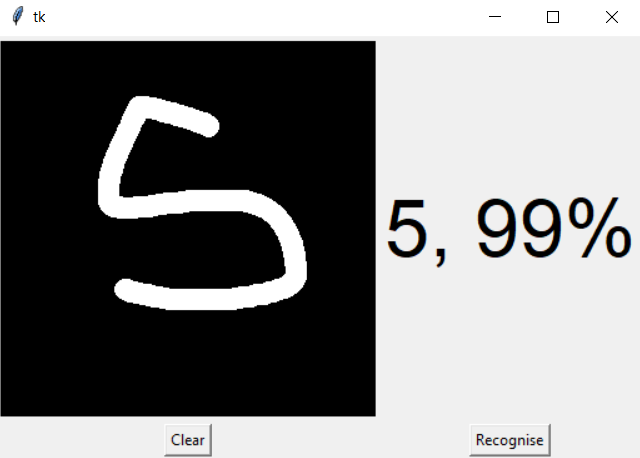
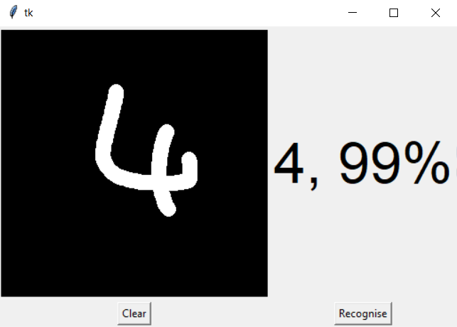
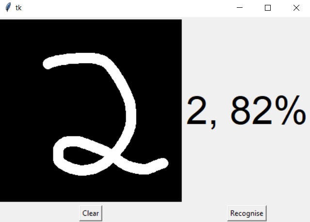

# Handwritten Digit Recognizer

This is meant to be a small exploration in the process of creating a CNN. It uses the well known MNIST dataset. 

Learning goals:
- purpose of each layer in a CNN
- various approaches for model configuration
- improving classification model accuracy

## Attempt 1

- Initial GUI consistently predicts 2 for all inputs.
- Model barely achieved 80% accuracy.

## Attempt 2

- Update GUI to have better image cropping and flip colours so writing is done in white instead of black.
- Model achieves 90.81% accuracy.
- GUI still predicts wrong somewhat frequently but is more accurate.

## Attempt 3

- Improve model feature extraction and switched to gradient descent for optimization.
- Model achieves 99.14% accuracy.
- Significant improvements in GUI performance, consistently correct with high confidence.

## Screenshots

# Credits
Starting code and initial GUI from https://data-flair.training/blogs/python-deep-learning-project-handwritten-digit-recognition/.
